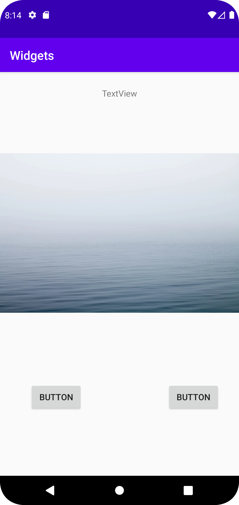

# Rapport

Widgets a22isahe

Utvecklingen av appen skedde i tre steg och efter varje steg gjordes en commit.

först lades en textview till
Denna kod genererades:
MarginTop lades till för att flytta ner texten.
Constraints sattes med hjälp av chains i constraintlayouten.

```
<TextView
android:id="@+id/textView"
android:layout_width="wrap_content"
android:layout_height="wrap_content"
android:layout_marginTop="25dp"
android:text="TextView"                    

//Constraints representeras i koden nedan:
app:layout_constraintEnd_toEndOf="parent"
app:layout_constraintStart_toStartOf="parent"
app:layout_constraintTop_toTopOf="parent" />
```

En imageview lades till från komponentträdet.
constraints sattes på samma sätt som för textview och en bild importerades.
Denna kod genererades i activity main_xml men layout_width ändrades till match-constraints (0dp), marginTop sattes till 40dp.
```
<ImageView
        android:id="@+id/imageView2"
        android:layout_width="0dp"
        android:layout_height="360dp"
        android:layout_marginTop="40dp"
        app:layout_constraintEnd_toEndOf="parent"
        app:layout_constraintHorizontal_bias="0.454"
        app:layout_constraintStart_toStartOf="parent"
        app:layout_constraintTop_toBottomOf="@+id/textView"
        app:srcCompat="@drawable/water" />
```

Sist lades två knappar till. deras constraints sattes så att de kunde sitta på samma nivå och följer imageview och textview.
Nedan syns representationen av knapparna i xml och deras två positioner skiljer sig åt i "app:layout_constraintEnd_toStartOf" och  
"app:layout_constraintStart_toStartOf" som bestämmer knappens horisontella position. width och height sattes til wrap_content för att följa textstorlek/längd.

```
<Button
        android:id="@+id/button5"
        android:layout_width="wrap_content"
        android:layout_height="wrap_content"
        android:text="Button"
        app:layout_constraintBottom_toBottomOf="parent"
        app:layout_constraintEnd_toStartOf="@+id/textView"
        app:layout_constraintHorizontal_bias="0.609"
        app:layout_constraintStart_toStartOf="@+id/imageView2"
        app:layout_constraintTop_toBottomOf="@+id/imageView2"
        app:layout_constraintVertical_bias="0.382" />

    <Button
        android:id="@+id/button6"
        android:layout_width="wrap_content"
        android:layout_height="wrap_content"
        android:text="Button"
        app:layout_constraintBottom_toBottomOf="parent"
        app:layout_constraintEnd_toEndOf="@+id/imageView2"
        app:layout_constraintHorizontal_bias="0.609"
        app:layout_constraintStart_toEndOf="@+id/textView"
        app:layout_constraintTop_toBottomOf="@+id/imageView2"
        app:layout_constraintVertical_bias="0.382" />
```





